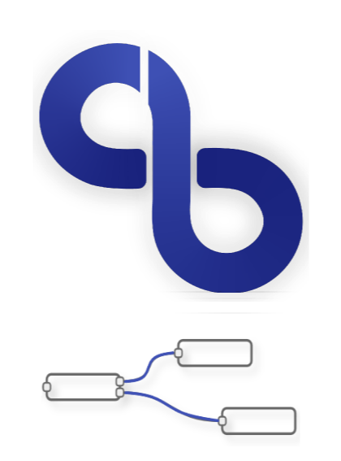

<!-- PROJECT LOGO -->
<br />
<p align="center" style="margin-bottom: -6px">
  <a href="https://github.com/butter-robotics/Butter.MAS.NodeRed/">
    
  </a>

  <h3 align="center">Butter MAS NodeRed API</h3>

  <p align="center">
    This repo defines Node-Red nodes that encapsulate Butter MAS API.
    <br />
    <br />
  </p>
</p>


<!-- TABLE OF CONTENTS -->
<details open="open">
  <summary><h2 style="display: inline-block">Table of Contents</h2></summary>
  <ol>
    <li>
      <a href="#about-the-project">About The Project</a>
      <ul>
        <li><a href="#built-with">Built With</a></li>
      </ul>
    </li>
    <li>
      <a href="#getting-started">Getting Started</a>
      <ul>
        <li><a href="#prerequisites">Prerequisites</a></li>
        <li><a href="#installation">Installation</a></li>
      </ul>
    </li>
    <li><a href="#usage">Usage</a></li>
    <li><a href="#contributing">Contributing</a></li>
    <li><a href="#license">License</a></li>
    <li><a href="#authors">Authors</a></li>
  </ol>
</details>


<!-- ABOUT THE PROJECT -->
## About The Project

This project extends the basic node-red node types with new nodes that encapsulate Butter Robotics operations and api calls.
This can prove very useful when building IoT flows and orchestration using Node-Red, and needing to use Butter as well.


### Built With

* [Butter Javascript API](https://github.com/butter-robotics/Butter.MAS.JavascriptAPI)
* [Node-Red](https://nodered.org/)


<!-- GETTING STARTED -->
## Getting Started

To get a local copy up and running follow these simple steps.


### Prerequisites

* Node-Red
  (Please refer to this [documentation](https://nodered.org/docs/getting-started/windows) for easy installation on Windows).


### Installation

* Install the package.
  ```sh
  npm install node-red-contrib-butter@latest -g
  ```
* Restart Node-Red and validate that the new nodes exist in your node pallette.


<!-- USAGE EXAMPLES -->
## Usage

Once you have completed the prerequisites, the new nodes should appear in all their glory in the node pallette:


You can drag the butter nodes to use in your flows:


For further explanation, please refer to the documentation given inside the node-red GUI.


_To learn more about Node-Red, please refer to their [Documentation](https://nodered.org/docs/)_\
_To understand more about Butter Robotics Javascript API, please refer to this [Documentation](https://github.com/butter-robotics/Butter.MAS.JavascriptAPI)_

<!-- CONTRIBUTING -->
## Contributing

We always have space for improvements, here is how to help:

1) Fork the repo.
2) Submit a PR.
3) Bump the version in package.json.
4) Write a concise summary of your change in the RELEASE-NOTES.md file. 

<!-- LICENSE -->
## License

Distributed under the Apache 2.0 License. See `LICENSE` for more information.

## Authors

* [Ron Gissin](https://github.com/RonGissin)
* [Benny Megidish](https://github.com/bennymeg)


