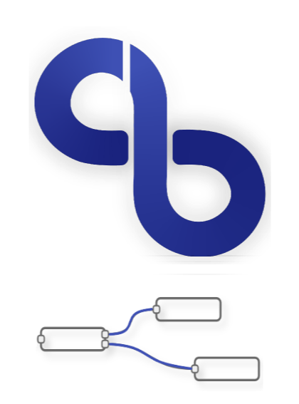

<p align="center" style="margin-bottom: -6px">
  <a href="https://github.com/butter-robotics/Butter.MAS.NodeRed/">
    
  </a>

  <h3 align="center">Butter MAS NodeRed API</h3>

  <p align="center">
    This repo defines Node-Red nodes that encapsulate Butter MAS API.
    <br />
    <br />
  </p>
</p>

<!-- ABOUT THE PROJECT -->
## About The Project

This project extends the basic node-red node types with new nodes that encapsulate Butter Robotics operations and api calls.
This can prove very useful when building IoT flows and orchestration using Node-Red, and needing to use Butter as well.


### Built With

* [Butter Javascript API](https://github.com/butter-robotics/Butter.MAS.JavascriptAPI)
* [Node-Red](https://nodered.org/)

## Getting Started

To get a local copy up and running follow these simple steps.


### Prerequisites

* Node-Red
  (Please refer to this [documentation](https://nodered.org/docs/getting-started/windows) for easy installation on Windows).


### Installation

* Install the package.
  ```sh
  npm install @butter-robotics/mas-node-red-api@latest -g
  ```
* Restart Node-Red and validate that the new nodes exist in your node pallette.

## Usage

Once you have completed the prerequisites, the new nodes should appear in all their glory in the node pallette:


You can drag the butter nodes to use in your flows:


For further explanation, please refer to the documentation given inside the node-red GUI.

## Documentation
- 👨🏼‍💻 [API](https://butterrobotics.com/#/library/documentation/mas_node_red),
- 🖋  [Licence](https://github.com/butter-robotics/Butter.MAS.NodeRed/blob/master/LICENSE)

_To learn more about Node-Red, please refer to their [Documentation](https://nodered.org/docs/)_\
_To understand more about Butter Robotics Javascript API, please refer to this [Documentation](https://butterrobotics.com/#/library/documentation/mas_javascript_api)_

## License

Distributed under the Apache 2.0 License. See `LICENSE` for more information.

## Authors

* [Benny Megidish](https://github.com/bennymeg)


